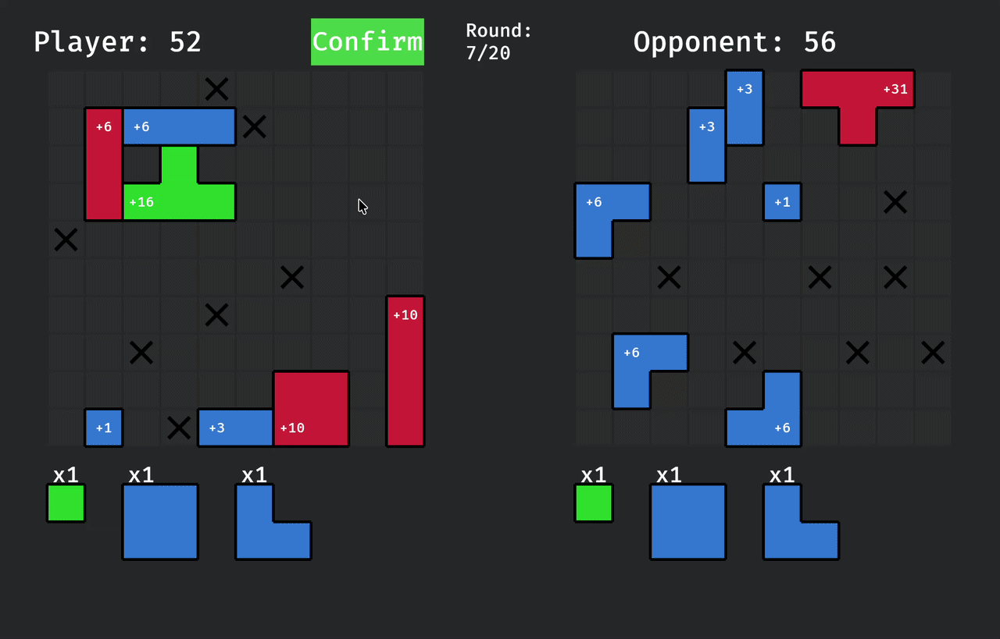

# Tightpack

[Play now](https://katalonecfly.github.io/tightpack/)

A polyomino placement game where players place pieces on a board to maximize their score. Features multiple game modes and a scoring system with conditional bonuses.



## Features

- **Four Game Modes**: Sandbox (free placement), Draft (random piece selection), Duel (player vs AI), and Puzzles (predefined challenges with solutions)
- **Drag-and-Drop Mechanics**: Intuitive piece manipulation with rotation, ghost previews, and visual feedback
- **Scoring System**: Base points plus conditional bonuses (effects)
- **Puzzle Mode**: Load puzzles from configuration files, save solutions, and view solution libraries
- **Cross-Platform**: Runs natively and in the browser via WebAssembly

## Game Modes

### Sandbox
Free placement mode with a scrollable inventory containing 10 copies of each piece. No restrictions or round limits.

### Draft
Three random pieces are offered per turn. Confirm button locks placed pieces and replenishes the stash. Rounds system with 1-99 rounds.

### Duel
Player vs AI on two separate boards. Supports two variations:
- **Basic**: Standard placement alternation
- **Destroy**: Alternates between placement and disabling opponent cells

AI modes:
- **Dummy**: Places the first legal piece
- **Random**: Chooses a random valid placement
- **Greedy**: Selects placements that maximize potential score

### Puzzles
Solve predefined puzzles with custom board sizes, blocked cells, and piece counts. Features:
- Load puzzles from `assets/puzzles/<id>/data.ron`
- Save user solutions (duplicate prevention)
- View solution libraries (right-click puzzle in list)
- Solutions validated and sorted by score

## Core Mechanics

### Pieces
- Polyominoes (size 1-4) loaded from `assets/pieces.ron`
- Static pieces maintain fixed colors and effects
- Dynamic pieces randomize color and select one effect with random offset subset

### Scoring
Uses triangular formula `piece_size * (piece_size + 1) / 2` for base points plus effect points. Effects include:
- **IsEmpty**: Bonus for empty target cells
- **MatchesColor(X)**: Bonus for target cells of color X
- **NoColorOnBoard(X)**: Bonus if no other X-colored pieces exist
- **MatchesSize(X)**: Bonus for target cells occupied by a piece of size X

### Interactions
- Drag pieces from stash or board to reposition
- Right-click on a piece to return it to stash
- Press `R` or right-click while dragging to rotate
- Hover to view piece information and effect previews

## Settings

Accessible from the main menu. Options include:

- **Block opponent's cell (Duel)**: Toggle Destroy mode – after each round, the player and AI disable a cell on the opponent's board.
- **AI Mode**: Choose between Dummy, Random, or Greedy AI behavior.
- **Rounds (1-99)**: Number of rounds for Draft and Duel modes.
- **Board Width / Height**: Adjust board dimensions (7-12 each) – applies to Sandbox, Draft, and Duel.
- **Same piece set (Duel)**: If enabled, both players receive the same draft pieces each round.

## Files

- `pieces.ron`: Library of piece definitions
- `effects.ron`: Effect descriptions with placeholder substitution
- `data.ron`: Puzzle definitions (board size, blocked cells, pieces)
- `solutions/*.ron`: Saved solutions (timestamp names for user saves)

## WebAssembly Support

The game compiles to WebAssembly with:
- All assets embedded using `include_str!`
- Puzzle solutions stored in `localStorage`
- Base solutions embedded at compile time
- Canvas auto-resizing with `fit_canvas_to_parent`

## Controls

| Action | Key / Input |
|--------|-------------|
| Pick up a piece | Left-click and drag |
| Place a piece | Release on valid board cell |
| Return piece to stash | Right-click on placed piece |
| Rotate piece | `R` key or right-click while dragging |
| View piece info | Hover over a piece |
| Reset current game | `Shift + N` |
| Go back | `Esc` key |

## Project Structure

<!-- TREEVIEW START -->
```bash
├── Makefile                          	# Build automation for WebAssembly
├── assets/
│   ├── effects.ron                     # Effect descriptions with placeholder substitution
│   ├── pieces.ron                      # Library of piece definitions
│   └── puzzles/
│       ├── 001/
│       │   ├── data.ron                # Puzzle definition (board size, blocked cells, pieces)
│       │   └── solutions/
│       │       └── base.ron            # Base solution for puzzle 001
│       ├── 002/
│       │   ├── data.ron                # Puzzle definition
│       │   └── solutions/
│       │       └── base.ron            # Base solution for puzzle 002
│       └── ...                         # Additional puzzles (003–006)
├── src/
│   ├── components.rs                   # ECS components
│   ├── config.rs                       # RON configuration parsing
│   ├── colors.rs                       # Color definitions and mapping
│   ├── helpers.rs                      # Utility functions
│   ├── resources.rs                    # Global resources
│   ├── puzzles.rs                      # Puzzle loading, validation, storage
│   ├── puzzle_ui.rs                    # Puzzle list, solution list, solution view
│   ├── systems/
│   │   ├── ai.rs                       # AI logic (placement and blocking)
│   │   ├── controls.rs                 # Controls screen
│   │   ├── draft.rs                    # Draft mode logic
│   │   ├── duel.rs                     # Duel mode logic
│   │   ├── interaction.rs              # Drag, drop, rotation
│   │   ├── inventory.rs                # Stash scrolling
│   │   ├── menu.rs                     # Main menu
│   │   ├── scoring.rs                  # Score calculation
│   │   ├── settings.rs                 # Settings UI
│   │   ├── setup.rs                    # Board and piece initialization
│   │   ├── ui.rs                       # UI updates (score, tooltips, effects)
│   │   └── visuals.rs                  # Piece rendering
│   └── main.rs                         # Application entry point and state management
└── ...                                 # Other project files (Cargo.toml, etc.)
```
<!-- TREEVIEW END -->

## Building and Running

### Native (Desktop)

Build and run the native version:

```bash
cargo run --release
```

Or build only:

```bash
cargo build --release
```

### Web (WebAssembly)

To build and run the game in your browser, follow these steps in order.

1. **Install the WebAssembly target for Rust** (if not already installed):

```bash
rustup target add wasm32-unknown-unknown
```

2. **Install `wasm-bindgen` CLI tool** (if not already installed):

```bash
cargo install wasm-bindgen-cli
```

3. **Build the WebAssembly version**:

```bash
make build-web
```

This compiles the Rust code for WebAssembly, generates JavaScript bindings, and copies the `web/index.html` into the `wasm-out/` output directory.

4. **Start a local web server** to serve the generated files:

```bash
make serve-web
```

A Python HTTP server will start on port 8000. Open your browser and go to `http://localhost:8000`.

> You can also combine steps 3 and 4 with a single command:
> `make run-web`

5. **Clean up** the build output when needed:

```bash
make clean
```

This removes the `wasm-out/` directory.

## Dependencies

- Bevy 0.18.1 with `bevy_picking` feature (enabled by default in the plugin)
- `rand` for randomization
- `ron` for RON configuration parsing
- `serde` (with `derive` feature) for serialization
- `chrono` for timestamps in solution files
- `regex` for pattern matching in solution filenames
- `getrandom` (with `wasm_js` feature) for WebAssembly compatibility
- `web-sys` (with `Storage` and `Window` features) for localStorage on WebAssembly
- `js-sys` for JavaScript interoperability on WebAssembly